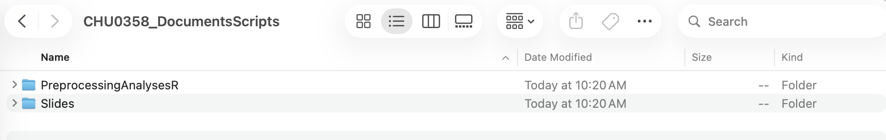
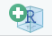
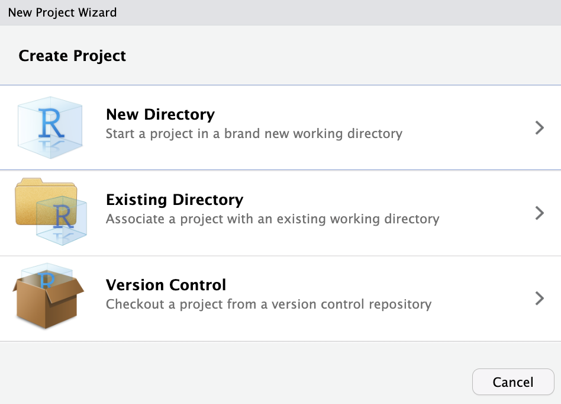
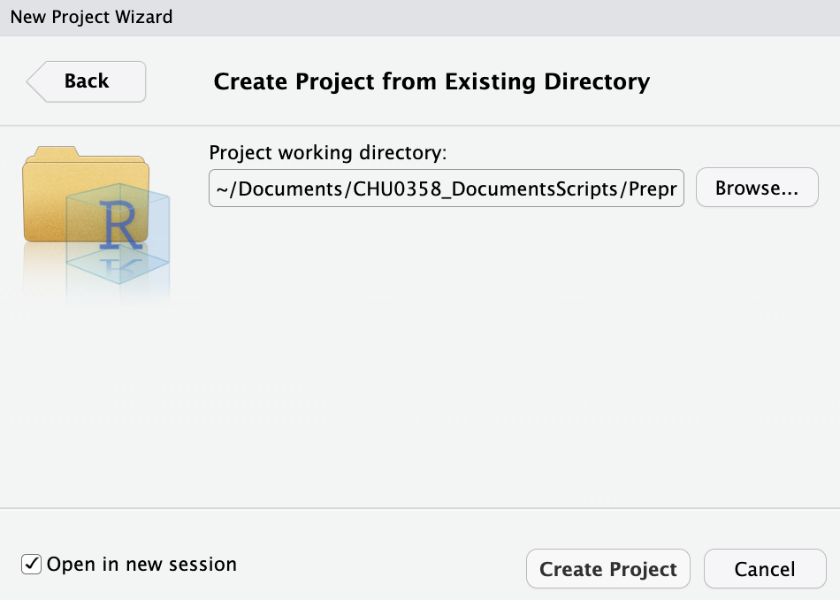
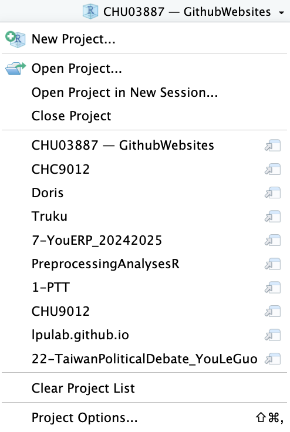

```{=html}
<style>
  
  /* Tabset Styling */
  .nav-tabs {
    border-bottom: 2px solid #ecf0f1;
    margin-top: 1em;
    margin-bottom: 30px;
  }
.nav-tabs .nav-link {
  font-weight: 700;
  font-size: 1.1em;
  color: #95a5a6;
    border: none;
  padding: 15px 25px;
  transition: all 0.3s ease;
}
.nav-tabs .nav-link:hover {
  color: #2c3e50;
    border: none;
}
.nav-tabs .nav-link.active {
  color: #3498db !important;
    background: none;
  border: none;
  border-bottom: 4px solid #3498db;
}

/* Stunning Headers */
  
  h2 {
    margin-top: 1.8em;
    color: #2980b9;
      font-weight: 600;
  }
h3 {
  margin-top: 1.5em;
  color: #2c3e50;
    font-weight: 600;
}

/* Floating Images with Animations */
  img {
    border-radius: 12px;
    box-shadow: 0 8px 25px rgba(0,0,0,0.06);
    transition: transform 0.4s cubic-bezier(0.175, 0.885, 0.32, 1.275), box-shadow 0.4s ease;
    margin: 2rem auto;
    display: block;
  }
img:hover {
  transform: translateY(-6px) scale(1.02);
  box-shadow: 0 15px 35px rgba(52,152,219,0.2);
}

/* Elegant Gradient Divider */
  hr.rounded {
    border: 0;
    height: 2px;
    background-image: linear-gradient(to right, rgba(0,0,0,0), rgba(52,152,219,0.5), rgba(0,0,0,0));
    margin: 4rem 0;
  }

/* Pro Code Styling */
  code {
    font-family: 'JetBrains Mono', monospace;
    font-size: 0.9em;
    color: #e74c3c;
      background-color: #fdf2f0;
      padding: 3px 6px;
    border-radius: 5px;
  }
pre code {
  color: #333;
    background-color: transparent;
}

/* Clean Tables */
  table {
    width: 100%;
    border-collapse: separate;
    border-spacing: 0;
    border-radius: 12px;
    overflow: hidden;
    box-shadow: 0 5px 15px rgba(0,0,0,0.05);
    margin: 2rem 0;
  }
th {
  background-color: #3498db;
    color: white;
  text-transform: uppercase;
  letter-spacing: 1px;
  padding: 15px;
  font-weight: 600;
}
td {
  background-color: white;
  padding: 15px;
  border-bottom: 1px solid #ecf0f1;
}

/* Emphasized bolding */
  b, strong {
    color: #2c3e50;
      font-weight: 700;
  }
</style>
```

## Overview

This week, we will have an introduction to the R language and the RStudio interface, which will be useful to analyze our data.

::: panel-tabset
## 🎯 Goals

-   **Basics:** What is R, and what is RStudio? How to download and install it?
-   **Getting ready:** How to prepare your computer for future analyses?

## 💻 Necessary codes

**A brief summary of the essential elements:**

No code this week, just pay extra attention!

## 📝 Homework

**Please complete the following tasks before our next meeting:**

-   Make sure that your computer is ready for next week.
:::

::: {.text-center .mb-4}
<a href="week10_slides.html" class="btn btn-outline-primary" target="_blank"> <i class="bi bi-window-stack"></i> View the slides of this week's tutorial </a>
:::

<br>

# 🎒 Part 1: Setup & Installation

:::::::::::: panel-tabset
## 1.1. What is R? What is RStudio?

So far, we have been talking about something called "R/RStudio". People familiar with this program know what this is about. However, it can be quite confusing when we have never heard of it. We are actually referring to two distinct, yet connected programs:

:::::::: columns
:::: {.column width="45%"}
::: {style="text-align: center; padding: 20px; background: white; border-radius: 12px; box-shadow: 0 4px 15px rgba(0,0,0,0.05);"}
<h3 style="color: #3498db; margin-top: 0;">

The Engine: R

</h3>

{width="120"}

<p style="font-size: 0.9em; color: #7f8c8d; margin-top: 15px;">

The main program where all the mathematical magic and deep computations happen.

</p>
:::
::::

::: {.column width="10%"}
:::

:::: {.column width="45%"}
::: {style="text-align: center; padding: 20px; background: white; border-radius: 12px; box-shadow: 0 4px 15px rgba(0,0,0,0.05);"}
<h3 style="color: #3498db; margin-top: 0;">

The Dashboard: RStudio

</h3>

{width="200"}

<p style="font-size: 0.9em; color: #7f8c8d; margin-top: 15px;">

A user-friendly interface that makes it incredibly easy to interact with R.

</p>
:::
::::
::::::::

<br>

Maybe a metaphor can help to understand the difference between R and RStudio. As you are engaging yourself in this tutorial, I assume that you have a computer. You can create folders, open Word or Excel documents, write in them, and save them in the folders you created.

::: {.callout-tip appearance="simple" icon="false"}
### 🧠 Think about it

Now it is time to reflect on what you are doing. You have done these tasks by using your mouse or your touchpad and clicking on icons (or figures) on your screen. What you may not know is that when doing so, you have actually run many hidden lines of code!

It is your computer that ran them in programs able to perform computations. Your role has been to trigger these programs by using the user-friendly interface installed in your computer.
:::

This is the exact same thing with R and RStudio. R will perform the computations that you ask for. And you will ask R to do stuff by clicking on icons and writing commands using the user-friendly interface of RStudio. And this is why you need to download two programs!

::: {.callout-note icon="false" appearance="minimal" style="background-color: #f8f9fa; border-left: 4px solid #f39c12;"}
**📖 Personal Anecdote**<br> Let me share a memory from when I first entered graduate school. I had my very first class of language programming for linguistic research. Just before leaving, the instructor said very quickly that we had to, I quote, *"download R for next time"*.

I had never heard of R, and to me, calling a program with only one letter seemed kind of awkward. I assumed I misheard the instructions. You can imagine how surprised I was when I googled "R" and found it actually existed!
:::

## 1.2. Download and Install

### Step 1: Download and install R

Go to the RStudio website by clicking <a href="https://www.r-project.org/" target="_blank">here</a>. You will see something like this:


Next, choose your **CRAN** (The Comprehensive R Archive Network). Let's choose the one in Taiwan. You will need to scroll down the page to find the link.


Choose the files to download according to your computer's operating system. The most common are macOS (for Apple computers) or Windows.


On the next page, choose the subdirectory. For our purposes, we only need the **"base"** subdirectory.


We finally got to the last page! Click on the first link to download the files, as shown below. Wait until the file is downloaded, open it, and follow the standard instructions to install R on your computer.


### Step 2: Download and install RStudio

Now that R is installed, it is time to do the same with RStudio. Go to the RStudio website by clicking <a href="https://posit.co/download/rstudio-desktop/" target="_blank">here</a>. You will see something like this:


Scroll down to look for the download links. Again, choose the right file for your operating system. Just click the link, let it download, open the file, and follow the instructions!


## 1.3. Launch and Try!

Look for the program called **"RStudio"** on your computer. Once you find it, just open it up, and you can move on to the next section!

::: {.callout-tip appearance="simple"}
### 💡 Wait, why didn't we open R?

Recall that R is the program where computations are done, and RStudio is the user-friendly interface. Even though we *needed* to download both, you actually **only ever need to open RStudio** when you want to use R! RStudio will talk to R in the background for you.
:::
::::::::::::

<hr>

# 📊 Part 2: Prepare your computer: R projects

The most terrifying part when working with experimental data is that by the end of your study, you will have many files in your computer. It is very easy to be messy, to mix files from different steps, and even to have scripts and files for which we have no idea what they are. Therefore, we need to prepare our computer for each study beforehand.

::::: panel-tabset
## 2.1. Prepare the folder in your computer

-   Please find you `Documents` (or 文件) folder.
-   Once you found it, please create a folder for this class (you can call it `CHU0358_DocumentsScripts`, for example)
-   Within this folder, please create subfolders, such as:
    -   `Slides`: Where you can store the slides from this class,
    -   `PreprocessingAnalysesR`: Where you will store the datasets and scripts we are going to use in the rest of this class.

In the end, your folder will look like this:



::: {.callout-tip appearance="simple"}
### Pay attention to the names

Generally, it is better not to use any space when naming folders and files! R is also case sensitive, so pay attention to the capital and small letters!
:::

## 2.2. Create an R project

-   There a small blue icon on the top-left side of RStudio. Please click on it.

    

<!-- -->

-   Then, click on "Existing Directory".

    

<!-- -->

-   In the next window, click on "Browse...", and look for the folder called `PreprocessingAnalysesR` that we just created. Please check `Open in a new session`, and on "Create Project".

    

::: {.callout-tip collapse="true" appearance="simple"}
### Why creating a project?

It will open a new and clean RStudio window. At the same time, it will set the `PreprocessingAnalysesR` as the working directory by default.

Another advantage is that you can have one RStudio window per project, and switch between them without worrying about the working directory of trying to find the right files! You can have a list of your several projects on the top-right corner of RStudio. Here is mine for example:


:::
:::::
