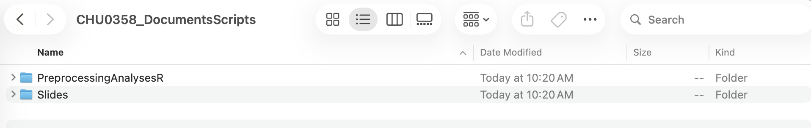

## 🎯 Goals & key concepts
**Get to know R:**

-   **Basics:** What is R, and what is RStudio? How to download and install it?
-   **Getting ready:** How to prepare your computer for future analyses?

# 🎒 Part 1: Setup & Installation

---

## 1.1. What is R? What is RStudio?

:::: {.columns}
::: {.column width="45%"}

  <h3 style="color: #3498db; margin-top: 0;">The Engine: R</h3>
  {width="360"}

The main program where all the mathematical magic and deep computations happen.

  

:::
  
::: {.column width="10%"}
:::
  
::: {.column width="45%"}

  <h3 style="color: #3498db; margin-top: 0;">The Dashboard: RStudio</h3>
  {width="600"}

A user-friendly interface that makes it incredibly easy to interact with R.

  

:::
::::

---

::: {.callout-tip appearance="simple"}
### 🧠 Think about it

With a computer, you can create folders, open Word or Excel documents, write in them, and save them in the folders you created.

You used your mouse or your touchpad and clicking on icons (or figures) on your screen to do so.
  
It is your computer that ran your behavior in programs able to perform computations.
<b>Your role</b>: Trigger these programs by using the user-friendly interface installed in your computer. 
:::

::: {.fragment .fade-up}

<b>R</b> = perform the computations that you ask for. 
  
<b>RStudio</b> = The user-friendly interface for R.

:::
  
---

## 1.2. Download and Install

::: {.panel-tabset}

### Step 1: Download and install R

Go to the RStudio website by clicking <a href="https://www.r-project.org/" target="_blank">here</a>. You will see something like this:

Next, choose your **CRAN** (The Comprehensive R Archive Network). Let's choose the one in Taiwan. You will need to scroll down the page to find the link. 

Choose the files to download according to your computer's operating system. The most common are macOS (for Apple computers) or Windows. 

  
On the next page, choose the subdirectory. For our purposes, we only need the **"base"** subdirectory.

  
We finally got to the last page! Click on the first link to download the files, as shown below. Wait until the file is downloaded, open it, and follow the standard instructions to install R on your computer. 

### Step 2: Download and install RStudio

Now that R is installed, it is time to do the same with RStudio. Go to the RStudio website by clicking <a href="https://posit.co/download/rstudio-desktop/" target="_blank">here</a>. You will see something like this:
  
  

  
Scroll down to look for the download links. Again, choose the right file for your operating system. Just click the link, let it download, open the file, and follow the instructions!
  
  

::: 

## 1.3. Launch and Try!

Look for the program called **"RStudio"** on your computer. Once you find it, just open it up, and you can move on to the next section!
  
::: {.callout-tip appearance="simple"}
### 💡 Wait, why didn't we open R?
Recall that R is the program where computations are done, and RStudio is the user-friendly interface. Even though we *needed* to download both, you actually **only ever need to open RStudio** when you want to use R! RStudio will talk to R in the background for you.
:::

# 💻 Part 2: Prepare your computer: R projects

------------------------------------------------------------------------

## {.center}

::: {.callout-tip appearance="simple" style="width: 60%; margin: auto;"}
### Why?

We want to be *organized* and **not messy**!
:::

::: {.fragment .fade-up}
-   **Section 1.1:** Prepare the folder in your computer.
:::

::: {.fragment .fade-up}
-   **Section 1.2:** Create the related R project.
:::

---

## 1.1 Setting up your folders {vertical-align="center"}

::: {.fragment}
1.  Navigate to your **`Documents`** (or **`文件`**) folder.
:::

::: {.fragment}
2.  Create your **root folder**: `CHU0358_DocumentsScripts`
:::

::: {.fragment}
3.  Add the **Project Subfolders**:
    *   📁 `Slides`: Presentation files.
    *   📁 `PreprocessingAnalysesR`: Datasets & R code.
:::

---

## You should obtain something like this {.center}

::: {.fragment}

::: {.callout-tip appearance="simple"}
### Pay attention to the names

Generally, it is better not to use any space when naming folders and files!
:::

:::

---

## 1.2 Initializing Your R Project {vertical-align="center"}

::: {.columns}

::: {.column width="60%"}

::: {.fragment data-fragment-index="1"}
**1. Launch `New Project Wizard`** <i class="fa-solid fa-square-plus" style="color: #2c7a7b;"></i>
 <small>Click the **blue cube icon** in the top-left corner of RStudio.</small>
:::

 

::: {.fragment data-fragment-index="2"}
**2. Select project type** <i style="color: #2c7a7b;"></i>
 <small>Choose **"Existing Directory"** to link R to your folder structure.</small>
:::

 

::: {.fragment data-fragment-index="3"}
**3. Finalize Connection** <i class="fa-solid fa-circle-check" style="color: #2c7a7b;"></i>
 <small>Browse to `PreprocessingAnalysesR`, check **"Open in a new session"**, and click **Create Project**.</small>
:::
:::

::: {.column width="40%"}
::: {.r-stack}
{.fragment .fade-in-then-out data-fragment-index="1" width="100"}

{.fragment .fade-in-then-out data-fragment-index="2" width="500"}

{.fragment data-fragment-index="3" width="500"}
:::
:::

:::

::: {.fragment}

::: {.callout-note appearance="simple" .fragment data-fragment-index="3"}
**Benefit:** An `.Rproj` file sets your "Working Directory" automatically!
:::

:::

---

## Other advantages of creating projects {.center}

::: {.columns}

::: {.column width="60%"}

1.  One RStudio window = One project
2.  Switch between them without worrying about the working directory of trying to find the right files!
3.  List of your projects on the top-right corner of RStudio. Here is mine for example:

:::

::: {.column width="40%"}

{width="400"}

:::

:::

---

## 📝 In-class exercise!
  

**Task list:**

-   [ ] Find the R script from last week and move it to the `PreprocessingAnalysesR` folder.
-   [ ] Open the script within your newly created project.

